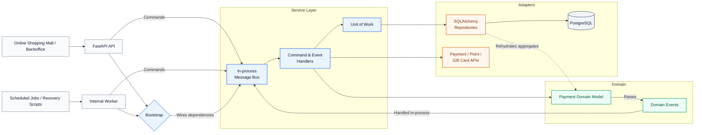

# Building and Maintaining Online Payment Systems for 10 Enterprise-Level Clients

## Project Summary

Served as backend engineer for Automata's online payment systems, processing over $500K per month in transactions across card payments, points, coupons, gift cards, subscriptions, refunds, cancellations, and backoffice operations.

| Metric | Result | Impact |
| --- | --- | --- |
| **4 months** | Promotion | Promoted from Backend Engineer I to Backend Engineer II within my first 4 months at Automata. |
| **$2.7M+/year** | Revenue | Contributed the company reached $2.7M USD in yearly net revenue. |
| **$500K+/mo** | Transaction | Supported systems processing over $500K/month in online transactions |
| **99.9%** | Reliability | Helped maintain 99.9% payment success rates. |
| **8+** | Partner payment options | Helped partners offer more valuable checkout options by integrating 5+ payment gateway providers, 3+ external point providers, and gift card provider flows. |
|**10 min to 1 sec**| Teamwork | Reduced Customer Service team's operation cost from 10 minutes to 1 second by making a backoffice interface |

## Background

[Automata](https://www.automata.ooo/) is a B2B online shopping platform service that provides branded online shopping mall infrastructure, including website operations and online payment systems, for major enterprise clients. In 2023, Automata served over 10 B2B clients and generated $2.7M in annual revenue.

<table>
  <tr>
    <td width="33%" align="center">
      
    </td>
    <td width="33%" align="center">
      
    </td>
    <td width="33%" align="center">
      
    </td>
  </tr>
</table>

  
    Sample online shopping mall launched through Automata's platform:
    <a href="https://www.shoppingeasy.co.kr/" target="_blank" rel="noopener noreferrer">ShoppingEasy</a>
  

When I joined in December 2022, the payment system was expanding across multiple marketplaces while the number of launched online stores increased by 60% during my tenure. The platform needed to evolve beyond card payments and support points, coupons, gift cards, subscriptions, and provider-specific checkout rules.

My role was to build and maintain stable payment features, provider integrations, recovery jobs, and backoffice workflows without sacrificing transaction accuracy, auditability, or operational reliability. I worked as Backend Engineer I and Backend Engineer II, receiving a promotion in April 2023.

## Tech Stack

| Stack | Summary |
| --- | --- |
| **Python / FastAPI** | Built backend payment workflows for checkout, subscriptions, cancellations, refunds, validations, batch jobs, and provider integrations. |
| **PostgreSQL / SQLAlchemy / Alembic** | Modeled and migrated payment data structures to preserve transaction accuracy, auditability, and operational reporting. |
| **Pydantic** | Defined request and response contracts for payment, cancellation, subscription, and provider APIs to keep integrations predictable. |
| **External APIs** | Integrated 5+ payment gateway providers, 3+ external point providers, and gift card providers into checkout, cancellation, reward, and reconciliation workflows. |
| **Pytest / Mypy / Flake8 / Locust** | Maintained regression confidence with unit, integration, E2E, type, lint, and load tests around payment reliability. |
| **Azure DevOps** | Managed delivery through ticket triage, bug resolution, implementation coordination, and closure across the software development cycle. |

## System Context

Harmony Transaction was a backend payment-processing service built with FastAPI, SQLAlchemy, and PostgreSQL. The architecture followed a Domain-Driven Design style similar to the structure popularized by *Architecture Patterns with Python*, separating domain behavior, persistence, transaction boundaries, and application orchestration.

| Component | Role |
| --- | --- |
| **Domain** | Encapsulated core payment business logic and state transitions for transactions, payments, refunds, cancellations, subscriptions, point usage, coupons, and gift cards without depending directly on infrastructure concerns. |
| **Repository** | Wrapped SQLAlchemy queries and exposed access to domain aggregates. |
| **UnitOfWork** | Managed SQLAlchemy session life-cycles and provided atomic commit/rollback behavior through context-manager based transaction handling. |
| **MessageBus** | Dispatched commands and domain events in-process to registered handlers for payment creation, payment-gateway callbacks, cancellations, refunds, subscriptions, and external API side effects. |
| **Bootstrap** | Wired concrete dependencies such as UnitOfWork implementations, external payment-gateway and point clients, repositories, and handler maps into the in-process MessageBus. |

## Actions

### Development Highlights

Developed core payment features, external provider integrations, and automated billing pipelines.

| Focus | Contribution |
| --- | --- |
| **Provider Integrations** | Integrated 5+ third-party payment gateway providers and 3+ external point providers into checkout, cancellation, and reward workflows. |
| **Gift Cards and Coupons** | Developed gift card and coupon transaction features, including pin issuance, status transitions, expiration handling, and refund-amount separation between card payments and points. |
| **Automated Billing** | Implemented an automated billing pipeline with cron jobs to support the new subscription product flow. |
| **Point System** | Designed and deployed the point history persistence layer, including database tables, repository access, list APIs, and request/response audit columns so point-related failures could be attributed and recovered. |
| **Automating Marketplace Setup** | Supported one-click per-marketplace payment gateway configuration by implementing payment gateway setting tables and CRUD APIs. |
| **Scheduled Recovery** | Built scheduled jobs for order state transitions and expired gift cards, plus reconciliation scripts for retrying missing point rewards and recovering payment data. |
| **Internal APIs** | Implemented internal service-to-service APIs consumed by upstream channel and product services. |

### Maintenance and Optimization Highlights

Ensured mission-critical system stability by patching validation gaps, optimizing database execution, and resolving concurrency issues that affected transaction integrity.

| Focus | Contribution |
| --- | --- |
| **Hardening Checkout Validation** | Preemptively blocked invalid checkout attempts by discovering and patching gaps in existing payment validation logic for amounts and quantities. |
| **Calculation Logic Hotfix** | Protected payment integrity by identifying a critical gift card calculation flaw and deploying a hotfix to prevent underpaid transactions. |
| **Query optimization** | Resolved an N+1 query bottleneck through eager loading, capping database execution at 3 queries regardless of data volume in the affected flow. |
| **Concurrency fix** | Diagnosed and resolved an asyncio concurrency bug that caused silent payment data loss under load; reproduced it with a targeted concurrency probe and secured transaction integrity by isolating Unit of Work injection per message. |
| **Test coverage** | Strengthened safe refactoring by building a testing pyramid across unit, integration, and E2E tests with over 75% coverage for core business logic. |

## Results

| Metric | Result | Impact |
| --- | --- | --- |
| **4 months** | Promotion | Promoted from Backend Engineer I to Backend Engineer II within my first 4 months at Automata. |
| **$2.7M+/year** | Revenue | Contributed the company reached $2.7M USD in yearly net revenue. |
| **$500K+/mo** | Transaction | Supported systems processing over $500K/month in online transactions |
| **99.9%** | Reliability | Helped maintain 99.9% payment success rates. |
| **8+** | Partner payment options | Helped partners offer more valuable checkout options by integrating 5+ payment gateway providers, 3+ external point providers, and gift card provider flows. |
|**10 min to 1 sec**| Teamwork | Reduced Customer Service team's operation cost from 10 minutes to 1 second by making a backoffice interface |

## Takeaways

- Building payment systems taught me that product design and feature coverage only matter when basic payment reliability is protected first. Amount validation, state transitions, auditability, and recovery paths need to be treated as core product requirements.
- Even simple internal tools can create meaningful business impact when they reduce repetitive operational work for teammates. Improving a backoffice workflow helped the Customer Service team resolve tasks faster and support business operations more efficiently.
- Resolving a system issue that persisted for weeks taught me the full debugging lifecycle: understand the architecture, reproduce the failure with the right test strategy, apply changes carefully, and monitor stability after deployment.
- Payment platforms need more than successful API integrations. They need idempotent flows, complete transaction history, provider-specific failure handling, and reconciliation mechanisms for cases that only appear in production.
