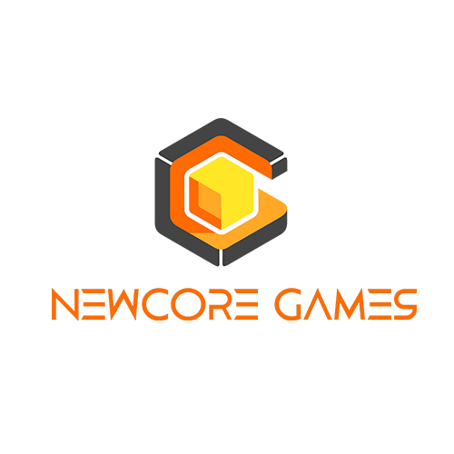

## 👽 About Me

Hi, I'm Houston, a software engineer with experience building global e-commerce payment systems 💵 and performing QA for video games 📼 and AR/XR training platforms.

Open Work Permit holder based in Canada 🇨🇦

  

## 🎥 Skills

These are technologies I have used across professional work and personal projects. I proactively learn the languages and tools with curiosity 👀 to solve the problem. 

  
  
  
  
  
  
  
  

  

## 🚂 Some of My Proudest Work

Selected case studies showing business impact, technical ownership, and product-quality improvements.

<table>
  <tr>
    <td align="center" width="33%">
      
    </td>
    <td align="center" width="33%">
      
    </td>
    <td align="center" width="33%">
      
    </td>
  </tr>
  <tr>
    <td align="left" valign="top">
      

        <strong>Automata</strong> 
        Backend Engineer - Payment Systems
      

       
      <strong>$500K+ monthly payment volume</strong> across enterprise shopping-mall operations while helping maintain <strong>99.9% payment reliability</strong>.  
      

        <a href="./Automata.md" target="_blank" rel="noopener noreferrer"><strong>View Portfolio</strong></a>
      

    </td>
    <td align="left" valign="top">
      

        <strong>NewCore Games</strong> 
        QA - Console / PC Game QA
      

       
      Shipping <strong><i>"The Devil within Satgat" </i> </strong> that reached <strong>100K+ global purchases</strong> and contributed to <strong>252% YoY revenue growth</strong>.  
      

        <a href="./NewCore.md" target="_blank" rel="noopener noreferrer"><strong>View Portfolio</strong></a>
      

    </td>
    <td align="left" valign="top">
      

        <strong>RaonSecure</strong> 
        QA - AR/XR Platform
      

       
      Reported <strong>150+ issues</strong> across Client, WebView, and Launcher while validating <strong>40+ AR/XR training modules</strong>.  
      

        <a href="./RaonSecure.md" target="_blank" rel="noopener noreferrer"><strong>View Portfolio</strong></a>
      

    </td>
  </tr>
</table>

  

## 🧪 Personal Projects

Things I build from scratch to understand how the hard parts actually work.

<table>
  <tr>
    <td align="center">
      
    </td>
  </tr>
  <tr>
    <td align="left" valign="top">
      

        <strong>Blue-Footed Booby</strong> 
        Monte Carlo Path Tracer - C++17 / DirectX 11 / GLM / Dear ImGui
      

       
      A physically-based renderer with <strong>from scratch</strong> - every ray/light-transport line written by hand. Global illumination, soft shadows, glass, and metal <i>emerge</i> from the rendering equation. A hand-built tile-based thread pool made it <strong>~10× faster</strong> - 77 s → 7.8 s per frame - and the result is verified <strong>pixel-identical</strong> to the serial render across all 1.44 M pixels.   
      

        <a href="https://github.com/labcows/BlueFootedBooby" target="_blank" rel="noopener noreferrer"><strong>View Project</strong></a>
      

    </td>
  </tr>
</table>

  

## 🚎 Outside of Work

I enjoy yoga, meditation, and spending time around nature. I also like observing wildlife 🐌, trees 🌴, and flowers 🌺 near the lake where I live.

  

## 🙌 Open To Solving Problems Together

I'm deeply curious about complex systems and find a lot of satisfaction in identifying, explaining, and solving problems. If you're working through something technical or product-related, I'd be happy to talk.
